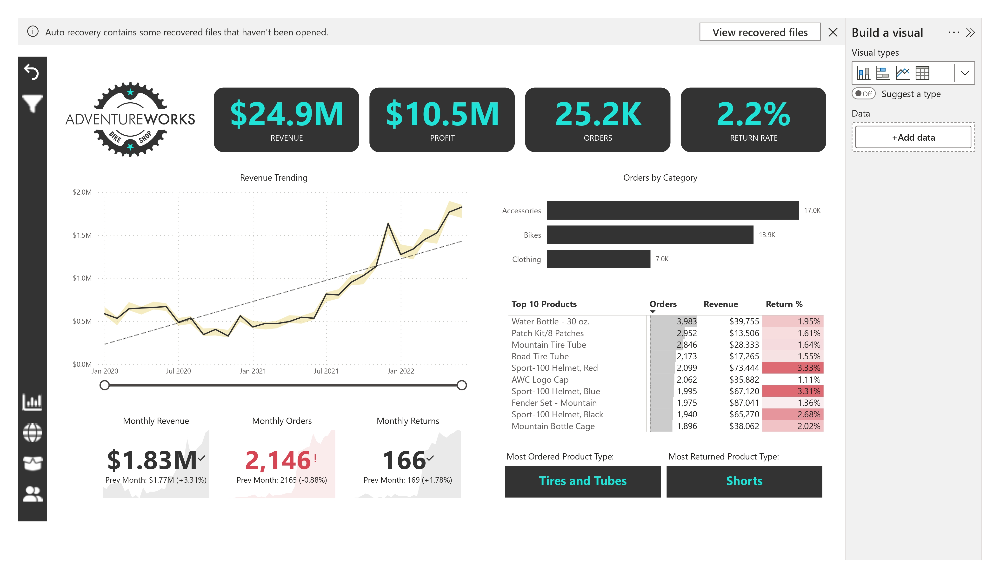
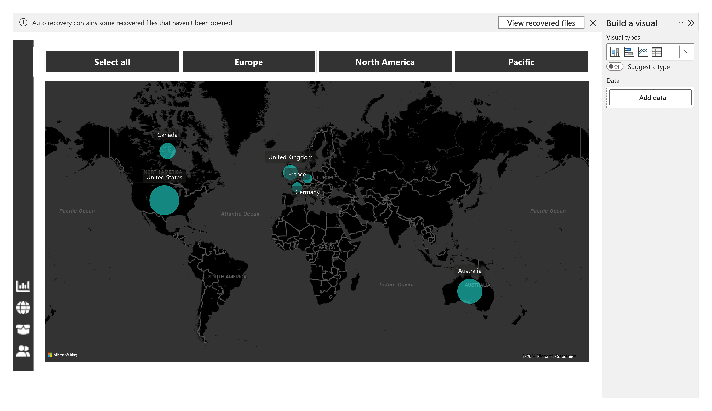
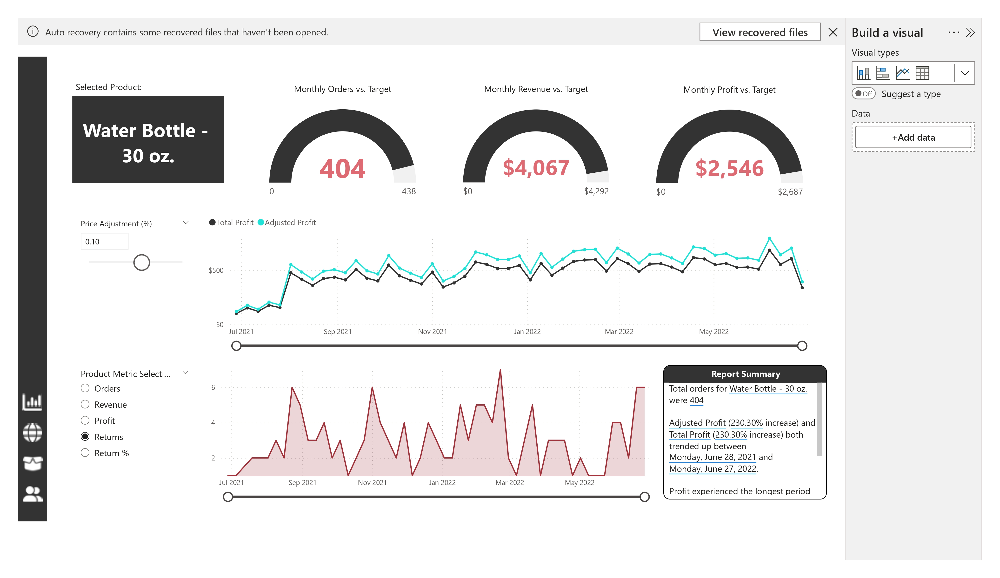
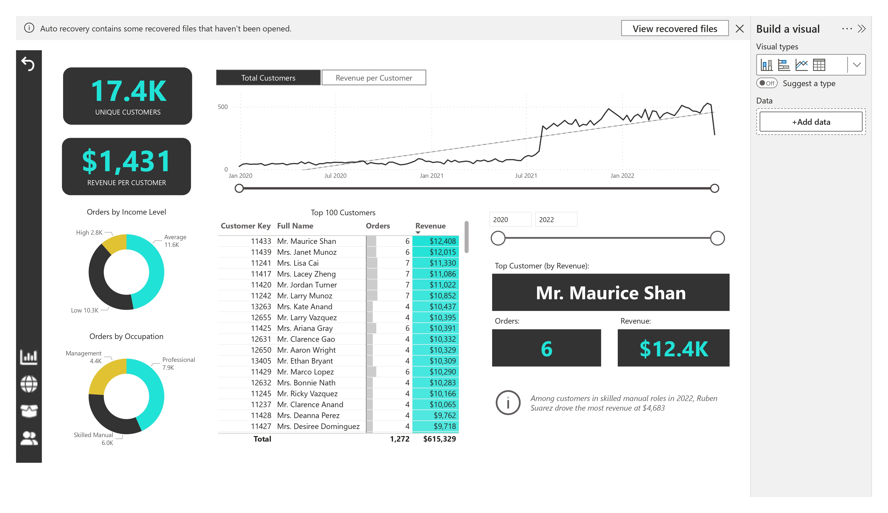

# Adventure Works Sales Analysis

Welcome to the Adventure Works Sales Analysis repository! This project aims to analyze sales data from the Adventure Works sample database using Power BI. 

## Project Overview

Adventure Works Sales Analysis is a demonstration project showcasing the capabilities of Power BI in analyzing and visualizing sales data. Through this project, you can explore various aspects of sales performance, product trends, and customer behavior within the Adventure Works dataset.

## Key Features

- **Interactive Dashboards**: Dive into dynamic dashboards with interactive visualizations to gain insights into sales metrics and trends.
  
- **Comparative Analysis**: Compare sales performance across different product categories, regions, and time periods to identify patterns and opportunities.
  
- **KPI Tracking**: Monitor key performance indicators such as sales revenue, profit margins, and customer satisfaction scores through intuitive visualizations.

## Screenshots

*Screenshot of interactive sales dashboard*

*Screenshot of Map Page*

*Screenshot of Product dashboard.*

*Screenshot of customer behavior analysis dashboard.*

## How to Use

1. Clone this repository to your local machine.
2. Open the `.pbix` file using Power BI Desktop.
3. Explore the various dashboards and visualizations to analyze the Adventure Works sales data.
4. Customize and extend the project according to your requirements.

## Contributing

Contributions are welcome! If you have any suggestions, improvements, or bug fixes, feel free to open an issue or create a pull request.
